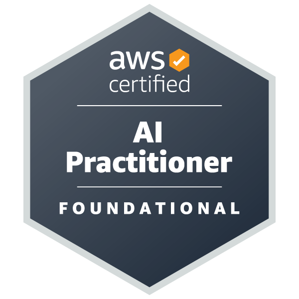
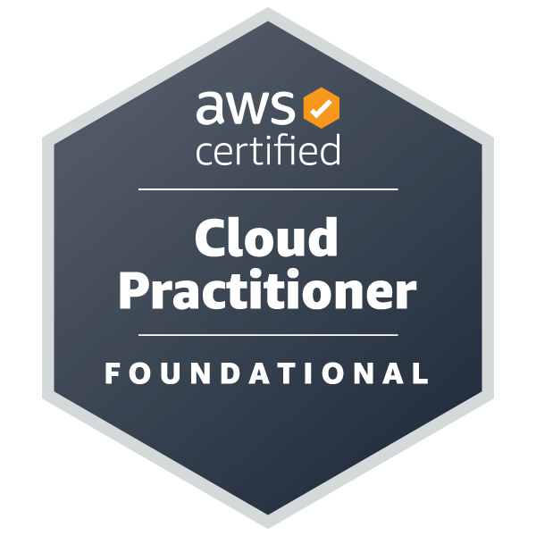
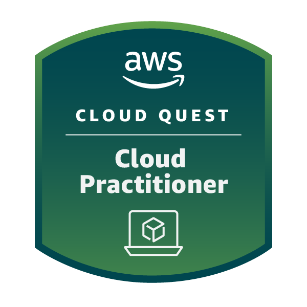

## Hi there, I´m Layon José 👋 

- 💼 Currently working at **Compass UOL** as an **AI/ML Developer (Junior)**
- 🔭 I’m currently studying Information System at Universidade Federal do Espírito Santo(UFES)
- 🌱 I’m currently learning cloud AWS
- 📚 Most used languages: [Click Here](https://ionicabizau.github.io/github-profile-languages/?user=Layonj3000)

## 🏅 Badges

## 📫 Contact

   

